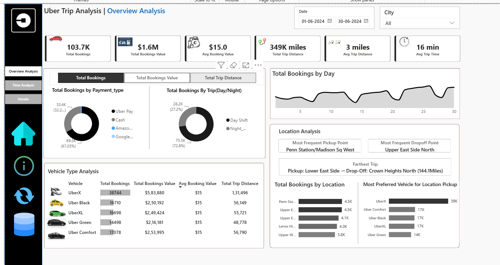
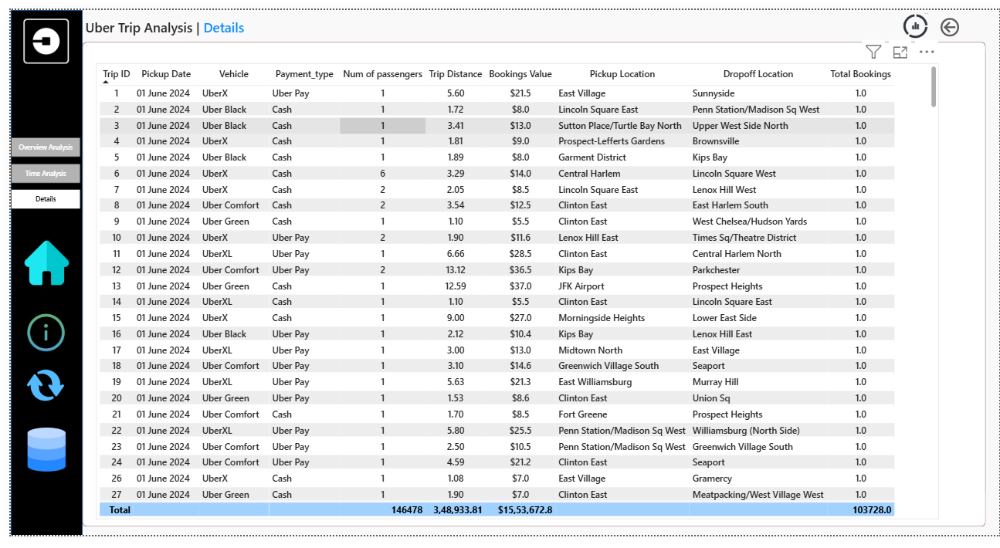

Analyze Uber trip data to uncover demand patterns, evaluate fare dynamics, optimize route efficiency, and deliver actionable insights for pricing and resource allocation.

**Data Modeling:** Built a star-schema connecting the `Trip Details` fact to `Location Table` and calendar/helper tables via `PULocationID` / `DOLocationID`.

**DAX & Dynamic Analytics:** Custom measures and a `Dynamic Measure` parameter enable KPI switching and dynamic titles.

**Spatial & Temporal Analysis:** Mapped location IDs to zones and analyzed bookings by hour/day to identify peaks.

**UI/UX Navigation:** Interactive canvas with bookmarks and quick navigation for drill-through and context-aware headers.

**Demand Identification:** Pinpointed peak hours and high-volume zones for driver allocation.

**Revenue Breakdown:** Analysed base fare vs surge, and payment-mode splits.

<ul>
	<li><strong>uber_Analysis.pbip</strong> — Power BI project file.</li>
	<li><strong>uber_Analysis.Report/</strong> — Extracted report JSON, visuals, and static resources.</li>
	<li><strong>uber_Analysis.SemanticModel/</strong> — TMDL model artifacts and `definition.pbism`.</li>
	<li><strong>dax_measures/</strong> — DAX reference files (`DAX.md`, `DAX_FULL.md`).</li>
</ul>
